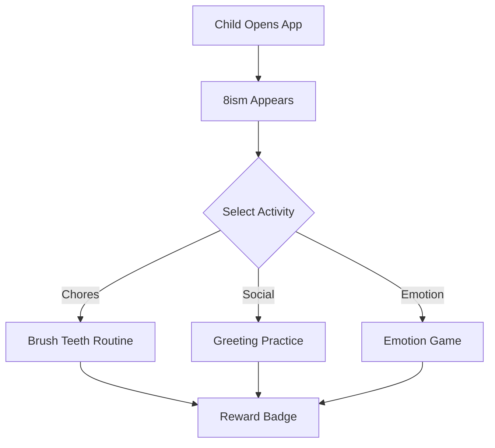

# 🤖🌈 8ism — AI-Powered Companion for Autistic Kids

<p align="center">
  
</p>

> **An interactive Augmented Reality + AI application designed to help autistic children practice daily chores, social interaction, and emotional recognition with a friendly virtual buddy named **8ism**.**

---

## ✨ Features

* 🧸 **AR Virtual Buddy** — Friendly 3D character guiding children
* 🧠 **AI Emotion Recognition** — Detects facial expressions & mood
* 🗣️ **Speech Interaction** — Simple voice-based commands & responses
* 📅 **Daily Chore Trainer** — Step‑by‑step routine assistance
* 🎮 **Gamified Rewards** — Stars, badges & animations
* 📊 **Parent Dashboard** — Progress tracking

---

## 🧩 How It Works (Animated Flow)



---

## 🎥 App Preview (Concept Animation)

<p align="center">
  
</p>

---

## 🛠️ Tech Stack

| Layer    | Technology                 |
| -------- | -------------------------- |
| AR       | Unity + ARCore / ARKit     |
| AI       | TensorFlow Lite, MediaPipe |
| Backend  | FastAPI / Firebase         |
| Frontend | Unity UI                   |
| Database | Firestore                  |

---

## 🧠 AI Modules

* **Emotion Detection** — CNN model on facial landmarks
* **Speech Recognition** — Whisper / Google STT
* **Routine Prediction** — LSTM for habit modeling
* **Behavior Scoring** — Reinforcement Learning

---

## 🚀 Installation

```bash
git clone https://github.com/Bxnkar/8ism.git
cd 8ism
pip install -r requirements.txt
```

---

## 📸 Screenshots (Animated)

<p align="center">
  
  
</p>

---

## 🎯 Future Scope

* 🌍 Multi‑language support
* 🤝 Therapist integration
* 🕶️ VR Mode
* 📈 Advanced analytics

---

## 👨‍💻 Author
**Om Bankar**
**Piyush Bambori**
BTech CSE (AI & ML) — Atlas SkillTech University

---

## ⭐ Show Some Love

If you like this project, give it a ⭐ on GitHub!

---

<p align="center">
  
  <br>
  <strong>"Learning made joyful with 8ism 💙"</strong>
</p>
